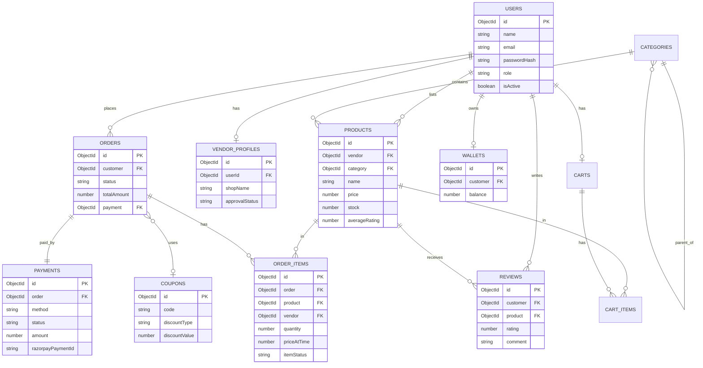

```mermaid
erDiagram
  USERS ||--o{ ORDERS : places
  USERS ||--o| VENDOR_PROFILES : has
  USERS ||--o{ PRODUCTS : lists
  USERS ||--o{ REVIEWS : writes
  USERS ||--o| WALLETS : owns
  USERS ||--o| CARTS : has

  CATEGORIES ||--o{ PRODUCTS : contains
  CATEGORIES ||--o{ CATEGORIES : parent_of

  PRODUCTS ||--o{ CART_ITEMS : in
  PRODUCTS ||--o{ ORDER_ITEMS : in
  PRODUCTS ||--o{ REVIEWS : receives

  CARTS ||--o{ CART_ITEMS : has
  ORDERS ||--o{ ORDER_ITEMS : has
  ORDERS ||--|| PAYMENTS : paid_by
  ORDERS }o--o| COUPONS : uses

  USERS {
    ObjectId id PK
    string name
    string email
    string passwordHash
    string role
    boolean isActive
  }
  VENDOR_PROFILES {
    ObjectId id PK
    ObjectId userId FK
    string shopName
    string approvalStatus
  }
  PRODUCTS {
    ObjectId id PK
    ObjectId vendor FK
    ObjectId category FK
    string name
    number price
    number stock
    number averageRating
  }
  ORDERS {
    ObjectId id PK
    ObjectId customer FK
    string status
    number totalAmount
    ObjectId payment FK
  }
  ORDER_ITEMS {
    ObjectId id PK
    ObjectId order FK
    ObjectId product FK
    ObjectId vendor FK
    number quantity
    number priceAtTime
    string itemStatus
  }
  PAYMENTS {
    ObjectId id PK
    ObjectId order FK
    string method
    string status
    number amount
    string razorpayPaymentId
  }
  REVIEWS {
    ObjectId id PK
    ObjectId customer FK
    ObjectId product FK
    number rating
    string comment
  }
  COUPONS {
    ObjectId id PK
    string code
    string discountType
    number discountValue
  }
  WALLETS {
    ObjectId id PK
    ObjectId customer FK
    number balance
  }
```
