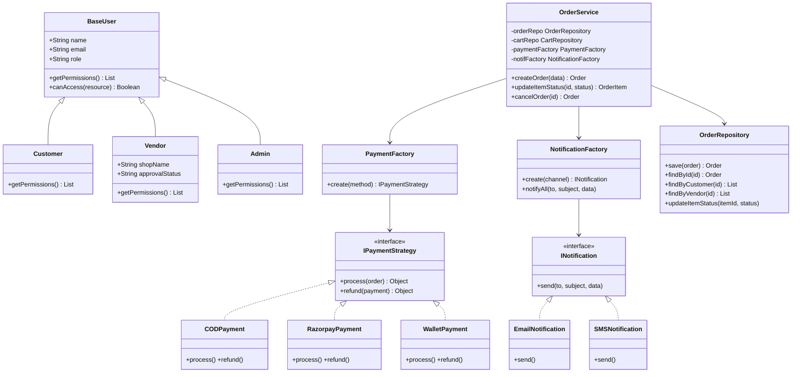

```mermaid
classDiagram
  class BaseUser {
    +String name
    +String email
    +String role
    +getPermissions() List
    +canAccess(resource) Boolean
  }
  class Customer {
    +getPermissions() List
  }
  class Vendor {
    +String shopName
    +String approvalStatus
    +getPermissions() List
  }
  class Admin {
    +getPermissions() List
  }
  BaseUser <|-- Customer
  BaseUser <|-- Vendor
  BaseUser <|-- Admin

  class IPaymentStrategy {
    <<interface>>
    +process(order) Object
    +refund(payment) Object
  }
  class CODPayment { +process() +refund() }
  class RazorpayPayment { +process() +refund() }
  class WalletPayment { +process() +refund() }
  class PaymentFactory {
    +create(method) IPaymentStrategy
  }
  IPaymentStrategy <|.. CODPayment
  IPaymentStrategy <|.. RazorpayPayment
  IPaymentStrategy <|.. WalletPayment
  PaymentFactory --> IPaymentStrategy

  class INotification {
    <<interface>>
    +send(to, subject, data)
  }
  class EmailNotification { +send() }
  class SMSNotification { +send() }
  class NotificationFactory {
    +create(channel) INotification
    +notifyAll(to, subject, data)
  }
  INotification <|.. EmailNotification
  INotification <|.. SMSNotification
  NotificationFactory --> INotification

  class OrderService {
    -orderRepo OrderRepository
    -cartRepo CartRepository
    -paymentFactory PaymentFactory
    -notifFactory NotificationFactory
    +createOrder(data) Order
    +updateItemStatus(id, status) OrderItem
    +cancelOrder(id) Order
  }
  class OrderRepository {
    +save(order) Order
    +findById(id) Order
    +findByCustomer(id) List
    +findByVendor(id) List
    +updateItemStatus(itemId, status)
  }
  OrderService --> OrderRepository
  OrderService --> PaymentFactory
  OrderService --> NotificationFactory
```
