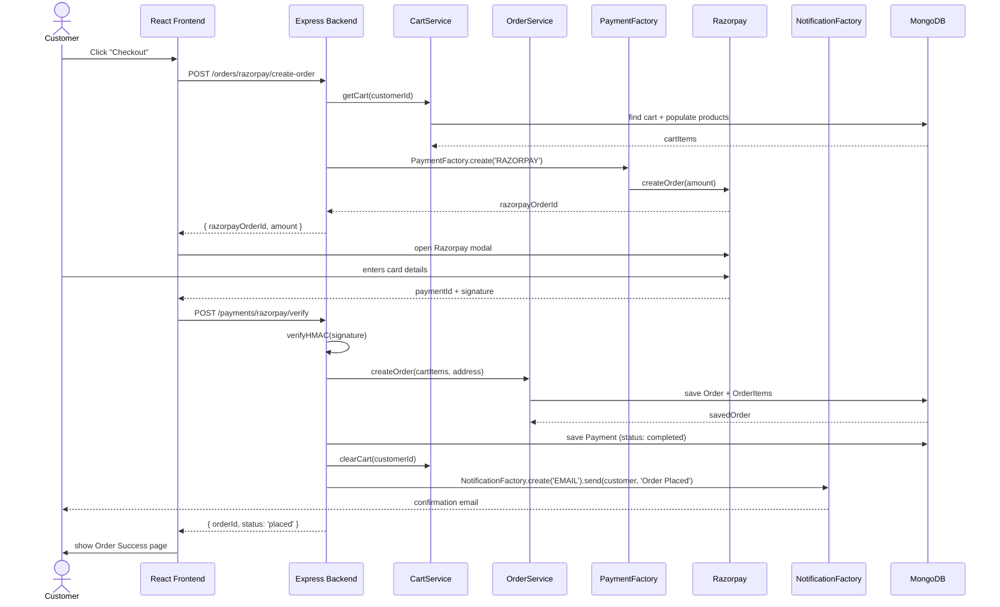

```mermaid
sequenceDiagram
  actor C as Customer
  participant FE as React Frontend
  participant API as Express Backend
  participant Cart as CartService
  participant Order as OrderService
  participant PF as PaymentFactory
  participant RZP as Razorpay
  participant NF as NotificationFactory
  participant DB as MongoDB

  C->>FE: Click "Checkout"
  FE->>API: POST /orders/razorpay/create-order
  API->>Cart: getCart(customerId)
  Cart->>DB: find cart + populate products
  DB-->>Cart: cartItems
  API->>PF: PaymentFactory.create('RAZORPAY')
  PF->>RZP: createOrder(amount)
  RZP-->>API: razorpayOrderId
  API-->>FE: { razorpayOrderId, amount }

  FE->>RZP: open Razorpay modal
  C->>RZP: enters card details
  RZP-->>FE: paymentId + signature

  FE->>API: POST /payments/razorpay/verify
  API->>API: verifyHMAC(signature)
  API->>Order: createOrder(cartItems, address)
  Order->>DB: save Order + OrderItems
  DB-->>Order: savedOrder
  API->>DB: save Payment (status: completed)
  API->>Cart: clearCart(customerId)
  API->>NF: NotificationFactory.create('EMAIL').send(customer, 'Order Placed')
  NF-->>C: confirmation email
  API-->>FE: { orderId, status: 'placed' }
  FE->>C: show Order Success page
```
