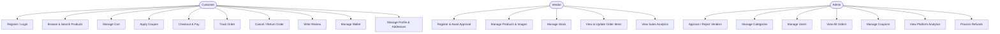

```mermaid
graph TD
  C([Customer]) --> UC1[Register / Login]
  C --> UC2[Browse & Search Products]
  C --> UC3[Manage Cart]
  C --> UC4[Apply Coupon]
  C --> UC5[Checkout & Pay]
  C --> UC6[Track Order]
  C --> UC7[Cancel / Return Order]
  C --> UC8[Write Review]
  C --> UC9[Manage Wallet]
  C --> UC10[Manage Profile & Addresses]

  V([Vendor]) --> UV1[Register & Await Approval]
  V --> UV2[Manage Products & Images]
  V --> UV3[Manage Stock]
  V --> UV4[View & Update Order Items]
  V --> UV5[View Sales Analytics]

  A([Admin]) --> UA1[Approve / Reject Vendors]
  A --> UA2[Manage Categories]
  A --> UA3[Manage Users]
  A --> UA4[View All Orders]
  A --> UA5[Manage Coupons]
  A --> UA6[View Platform Analytics]
  A --> UA7[Process Refunds]
```
